# Entity Relationship Diagram

## LoanFlow - Loan Origination System

This document contains the Entity Relationship Diagram (ERD) for the LoanFlow system using Mermaid syntax.

---

## Complete ERD

```mermaid
erDiagram
    %% ==========================================
    %% IDENTITY SCHEMA
    %% ==========================================

    USERS {
        uuid id PK
        varchar keycloak_id UK
        varchar employee_id UK
        varchar email UK
        varchar mobile
        varchar first_name
        varchar last_name
        varchar display_name
        varchar branch_code
        varchar department
        varchar designation
        uuid reporting_to FK
        varchar status
        timestamp last_login_at
        timestamp created_at
        timestamp updated_at
        uuid created_by FK
        uuid updated_by FK
    }

    ROLES {
        uuid id PK
        varchar code UK
        varchar name
        text description
        boolean is_system_role
        varchar status
        timestamp created_at
        timestamp updated_at
    }

    PERMISSIONS {
        uuid id PK
        varchar code UK
        varchar name
        text description
        varchar module
        varchar action
        varchar resource
        timestamp created_at
    }

    ROLE_PERMISSIONS {
        uuid role_id PK,FK
        uuid permission_id PK,FK
        timestamp created_at
        uuid created_by FK
    }

    USER_ROLES {
        uuid user_id PK,FK
        uuid role_id PK,FK
        varchar branch_code
        date valid_from
        date valid_to
        timestamp created_at
        uuid created_by FK
    }

    %% Identity Relationships
    USERS ||--o{ USER_ROLES : "has"
    ROLES ||--o{ USER_ROLES : "assigned_to"
    ROLES ||--o{ ROLE_PERMISSIONS : "has"
    PERMISSIONS ||--o{ ROLE_PERMISSIONS : "granted_to"
    USERS ||--o| USERS : "reports_to"

    %% ==========================================
    %% APPLICATION SCHEMA
    %% ==========================================

    LOAN_PRODUCTS {
        uuid id PK
        varchar code UK
        varchar name
        varchar category
        varchar sub_category
        text description
        decimal min_amount
        decimal max_amount
        int min_tenure_months
        int max_tenure_months
        decimal min_interest_rate
        decimal max_interest_rate
        decimal processing_fee_percent
        boolean is_secured
        boolean collateral_required
        boolean psl_eligible
        varchar psl_category
        varchar status
        date effective_from
        date effective_to
        timestamp created_at
        timestamp updated_at
    }

    LOAN_APPLICATIONS {
        uuid id PK
        varchar application_number UK
        uuid product_id FK
        varchar branch_code
        varchar channel
        decimal requested_amount
        decimal approved_amount
        int tenure_months
        varchar purpose
        varchar status
        varchar sub_status
        varchar decision
        timestamp decision_date
        uuid decision_by FK
        text decision_remarks
        text[] rejection_reasons
        decimal internal_score
        varchar risk_grade
        timestamp submitted_at
        date expected_disbursement_date
        date actual_disbursement_date
        timestamp created_at
        timestamp updated_at
        uuid created_by FK
        uuid updated_by FK
        boolean is_deleted
    }

    APPLICANTS {
        uuid id PK
        uuid application_id FK
        varchar applicant_type
        varchar relationship_with_primary
        varchar customer_id
        varchar salutation
        varchar first_name
        varchar middle_name
        varchar last_name
        varchar father_name
        varchar mother_name
        varchar spouse_name
        date date_of_birth
        varchar gender
        varchar marital_status
        varchar nationality
        varchar resident_status
        varchar pan
        boolean pan_verified
        varchar aadhaar_last4
        boolean aadhaar_verified
        varchar mobile_primary
        varchar mobile_secondary
        varchar email
        decimal annual_income
        decimal monthly_income
        varchar income_source
        decimal existing_emi
        boolean is_politically_exposed
        boolean kyc_verified
        timestamp kyc_verified_at
        varchar ckyc_number
        timestamp created_at
        timestamp updated_at
    }

    ADDRESSES {
        uuid id PK
        uuid applicant_id FK
        varchar address_type
        varchar address_line1
        varchar address_line2
        varchar address_line3
        varchar landmark
        varchar city
        varchar district
        varchar state
        varchar pincode
        varchar country
        varchar residence_type
        int years_at_address
        boolean is_verified
        timestamp verified_at
        uuid verified_by FK
        timestamp created_at
        timestamp updated_at
    }

    EMPLOYMENT_DETAILS {
        uuid id PK
        uuid applicant_id FK
        varchar employment_type
        varchar employer_name
        varchar employer_type
        varchar designation
        varchar department
        varchar employee_id
        date date_of_joining
        int years_in_current_job
        int total_experience_years
        varchar office_email
        varchar office_phone
        varchar business_name
        varchar business_type
        varchar constitution
        varchar gstin
        int business_vintage_years
        decimal annual_turnover
        decimal net_profit
        decimal gross_monthly_income
        decimal net_monthly_income
        decimal other_income
        varchar other_income_source
        boolean is_verified
        timestamp verified_at
        timestamp created_at
        timestamp updated_at
    }

    COLLATERALS {
        uuid id PK
        uuid application_id FK
        varchar collateral_type
        text property_address
        varchar property_city
        varchar property_state
        varchar property_pincode
        decimal property_area_sqft
        int property_age_years
        varchar property_ownership
        varchar vehicle_make
        varchar vehicle_model
        varchar vehicle_variant
        int vehicle_year
        varchar vehicle_registration
        decimal gold_weight_grams
        varchar gold_purity
        varchar gold_type
        decimal market_value
        decimal forced_sale_value
        date valuation_date
        varchar valuation_agency
        varchar valuation_report_number
        boolean is_encumbered
        text existing_charges
        varchar cersai_registration_number
        date cersai_registration_date
        varchar status
        timestamp created_at
        timestamp updated_at
    }

    LOAN_OFFERS {
        uuid id PK
        uuid application_id FK
        varchar offer_number UK
        decimal offered_amount
        decimal interest_rate
        varchar interest_type
        int tenure_months
        decimal emi
        decimal processing_fee
        decimal processing_fee_waived
        decimal documentation_charges
        decimal insurance_premium
        decimal total_deductions
        decimal net_disbursement
        timestamp valid_from
        timestamp valid_until
        varchar status
        timestamp accepted_at
        uuid accepted_by FK
        text[] conditions
        text special_terms
        timestamp created_at
        uuid created_by FK
    }

    APPLICATION_STATUS_HISTORY {
        uuid id PK
        uuid application_id FK
        varchar from_status
        varchar to_status
        text remarks
        timestamp changed_at
        uuid changed_by FK
    }

    %% Application Relationships
    LOAN_PRODUCTS ||--o{ LOAN_APPLICATIONS : "used_for"
    LOAN_APPLICATIONS ||--o{ APPLICANTS : "has"
    LOAN_APPLICATIONS ||--o{ COLLATERALS : "secured_by"
    LOAN_APPLICATIONS ||--o{ LOAN_OFFERS : "receives"
    LOAN_APPLICATIONS ||--o{ APPLICATION_STATUS_HISTORY : "tracks"
    APPLICANTS ||--o{ ADDRESSES : "lives_at"
    APPLICANTS ||--o{ EMPLOYMENT_DETAILS : "works_at"
    USERS ||--o{ LOAN_APPLICATIONS : "creates"
    USERS ||--o{ LOAN_APPLICATIONS : "decides"

    %% ==========================================
    %% DOCUMENT SCHEMA
    %% ==========================================

    DOCUMENT_TYPES {
        uuid id PK
        varchar code UK
        varchar name
        varchar category
        text description
        boolean is_mandatory
        text[] allowed_formats
        int max_size_mb
        varchar[] applicant_type
        uuid[] loan_products
        varchar status
        timestamp created_at
        timestamp updated_at
    }

    DOCUMENTS {
        uuid id PK
        uuid application_id FK
        uuid applicant_id FK
        uuid document_type_id FK
        varchar file_name
        varchar original_file_name
        varchar file_extension
        bigint file_size_bytes
        varchar mime_type
        text storage_path
        varchar storage_bucket
        varchar checksum
        boolean is_encrypted
        varchar encryption_key_id
        varchar ocr_status
        jsonb extracted_data
        decimal confidence_score
        varchar verification_status
        timestamp verified_at
        uuid verified_by FK
        text rejection_reason
        date document_date
        date expiry_date
        varchar reference_number
        timestamp uploaded_at
        uuid uploaded_by FK
        boolean is_deleted
        timestamp deleted_at
        uuid deleted_by FK
    }

    DOCUMENT_VERIFICATIONS {
        uuid id PK
        uuid document_id FK
        varchar verification_type
        varchar verification_source
        varchar status
        text remarks
        jsonb verification_data
        timestamp verified_at
        uuid verified_by FK
    }

    %% Document Relationships
    DOCUMENT_TYPES ||--o{ DOCUMENTS : "categorizes"
    LOAN_APPLICATIONS ||--o{ DOCUMENTS : "contains"
    APPLICANTS ||--o{ DOCUMENTS : "provides"
    DOCUMENTS ||--o{ DOCUMENT_VERIFICATIONS : "undergoes"
    USERS ||--o{ DOCUMENTS : "uploads"
    USERS ||--o{ DOCUMENTS : "verifies"

    %% ==========================================
    %% COMPLIANCE SCHEMA
    %% ==========================================

    KYC_RECORDS {
        uuid id PK
        uuid application_id FK
        uuid applicant_id FK
        varchar kyc_type
        varchar ckyc_number
        timestamp ckyc_verified_at
        varchar aadhaar_reference_number
        varchar ekyc_txn_id
        timestamp ekyc_timestamp
        varchar ekyc_response_code
        varchar status
        date verification_date
        date expiry_date
        varchar pep_check_status
        varchar sanction_check_status
        varchar negative_list_check_status
        jsonb response_data
        timestamp created_at
        timestamp updated_at
    }

    CERSAI_REGISTRATIONS {
        uuid id PK
        uuid application_id FK
        uuid collateral_id FK
        varchar registration_type
        varchar asset_type
        varchar cersai_registration_number
        date cersai_registration_date
        varchar cersai_txn_id
        varchar status
        text rejection_reason
        date filing_date
        date filing_due_date
        timestamp created_at
        timestamp updated_at
    }

    CREDIT_BUREAU_REPORTS {
        uuid id PK
        uuid application_id FK
        uuid applicant_id FK
        varchar bureau_name
        varchar inquiry_type
        varchar request_reference
        timestamp request_timestamp
        varchar response_reference
        timestamp response_timestamp
        int credit_score
        varchar score_version
        text[] score_factors
        int total_accounts
        int active_accounts
        int overdue_accounts
        int written_off_accounts
        decimal total_outstanding
        decimal total_overdue
        int dpd_30_plus_count
        int dpd_90_plus_count
        int enquiry_count_30_days
        int enquiry_count_90_days
        jsonb report_data
        varchar status
        text error_message
        timestamp created_at
        timestamp expires_at
    }

    AUDIT_LOGS {
        uuid id PK
        varchar event_type
        varchar event_category
        varchar entity_type
        uuid entity_id
        varchar entity_number
        uuid actor_id
        varchar actor_type
        varchar actor_email
        varchar actor_ip
        text actor_user_agent
        varchar action
        text description
        jsonb old_values
        jsonb new_values
        varchar session_id
        varchar request_id
        varchar module
        timestamp event_timestamp
        varchar checksum
    }

    %% Compliance Relationships
    LOAN_APPLICATIONS ||--o{ KYC_RECORDS : "requires"
    APPLICANTS ||--o{ KYC_RECORDS : "verifies"
    LOAN_APPLICATIONS ||--o{ CERSAI_REGISTRATIONS : "registers"
    COLLATERALS ||--o{ CERSAI_REGISTRATIONS : "secures"
    LOAN_APPLICATIONS ||--o{ CREDIT_BUREAU_REPORTS : "checks"
    APPLICANTS ||--o{ CREDIT_BUREAU_REPORTS : "reports_on"
    USERS ||--o{ AUDIT_LOGS : "generates"

    %% ==========================================
    %% NOTIFICATION SCHEMA
    %% ==========================================

    NOTIFICATION_TEMPLATES {
        uuid id PK
        varchar code UK
        varchar name
        varchar category
        varchar channel
        varchar subject
        text body
        text[] variables
        boolean is_active
        varchar priority
        varchar language
        timestamp created_at
        timestamp updated_at
        uuid created_by FK
        uuid updated_by FK
    }

    NOTIFICATION_LOGS {
        uuid id PK
        uuid template_id FK
        uuid application_id FK
        uuid applicant_id FK
        uuid user_id FK
        varchar channel
        varchar recipient
        varchar subject
        text body
        varchar status
        timestamp sent_at
        timestamp delivered_at
        varchar provider_reference
        text error_message
        int retry_count
        timestamp created_at
    }

    %% Notification Relationships
    NOTIFICATION_TEMPLATES ||--o{ NOTIFICATION_LOGS : "generates"
    LOAN_APPLICATIONS ||--o{ NOTIFICATION_LOGS : "triggers"
    APPLICANTS ||--o{ NOTIFICATION_LOGS : "receives"
    USERS ||--o{ NOTIFICATION_LOGS : "receives"
```

---

## Domain-Focused ERDs

### 1. Loan Application Domain

### 2. Document Management Domain

### 3. Compliance Domain

### 4. Identity & Access Domain

---

## Data Flow Diagram

---

## State Machine Diagrams

### Application Status State Machine

### Document Verification State Machine

---

## Cardinality Reference

| Relationship | Cardinality | Description |
|-------------|-------------|-------------|
| LOAN_APPLICATION → APPLICANTS | 1:N | One application has multiple applicants (primary + co-applicants) |
| LOAN_APPLICATION → COLLATERALS | 1:N | One application can have multiple collaterals |
| LOAN_APPLICATION → LOAN_OFFERS | 1:N | One application can receive multiple offers over time |
| LOAN_APPLICATION → DOCUMENTS | 1:N | One application has multiple documents |
| APPLICANT → ADDRESSES | 1:N | One applicant can have multiple addresses |
| APPLICANT → EMPLOYMENT_DETAILS | 1:N | One applicant can have multiple employment records |
| DOCUMENT → DOCUMENT_VERIFICATIONS | 1:N | One document can undergo multiple verifications |
| USER → USER_ROLES | 1:N | One user can have multiple roles |
| ROLE → ROLE_PERMISSIONS | 1:N | One role can have multiple permissions |

---

## Notes

1. **Primary Keys**: All tables use UUID as primary key for distributed systems compatibility
2. **Audit Columns**: All major tables include created_at, updated_at, created_by, updated_by
3. **Soft Delete**: Critical tables support soft delete with is_deleted, deleted_at, deleted_by
4. **Immutable Audit**: AUDIT_LOGS table prevents UPDATE and DELETE operations
5. **Encryption**: Sensitive fields like credit reports are stored encrypted (JSONB with encryption key reference)
6. **Indexing Strategy**: Indexes on frequently queried columns (status, application_number, pan, etc.)
